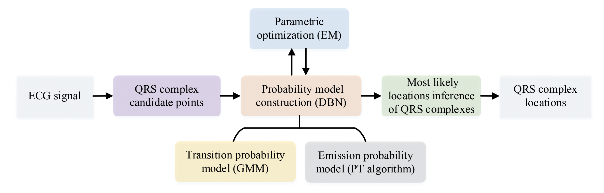

# A Novel ECG QRS Complex Detection Algorithm Based on Dynamic Bayesian Network



## Project Description

Accurate detection of the QRS complex, a crucial reference for heartbeat localization in electrocardiogram (ECG) signals, remains inadequate in wearable ECG devices due to complex noise interference. In this study, we propose a novel QRS complex detection method based on dynamic Bayesian network (DBN), integrating the probability distribution of RR intervals. 

Unlike methods focusing solely on ECG waveforms, our approach explicitly integrates ECG waveform and heart rhythm information into a unified probability model, enhancing noise robustness. Additionally, an unsupervised parameter optimization using expectation maximization (EM) adapts to individual differences of patients. Furthermore, several simplification strategies improve reasoning efficiency, and an online detection mode enables real-time applications.

Our method outperforms other state-of-the-art QRS detection methods, including deep learning (DL) methods, on noisy datasets. The proposed DBN-based QRS detection algorithm demonstrates outstanding accuracy, noise robustness, generalization ability, real-time capability, and strong scalability, indicating its potential application in wearable ECG devices.

## Installation

1. Clone this repository:
```bash
git clone git@github.com:sdnjly/DBN_QRSDetector.git
cd DBN_QRSDetector
```

2. Create and activate a Python virtual environment (recommended):

**Using conda:**
```bash
conda create -n dbn-qrs python=3.8
conda activate dbn-qrs
```

**Using venv:**
```bash
python -m venv venv
source venv/bin/activate  # On Windows use `venv\Scripts\activate`
```

3. Install dependencies:
```bash
pip install -r requirements.txt
```

## Usage

To test the algorithm on MIT-BIH Arrhythmia Database data:

1. Ensure you have MIT-BIH data files (e.g., 108.*) in the `dataset/mitdb/` directory

2. Run the main script:
```bash
python main_mitdb.py
```

This will:
- Load ECG data from MIT-BIH database
- Detect QRS complexes using our DBN-based algorithm
- Compare results with reference annotations
- Output detection accuracy metrics

## Key Features

- Dynamic Bayesian Network model integrating ECG waveform and RR interval information
- Unsupervised parameter adaptation using EM algorithm
- Real-time capable online detection mode
- Robust performance in noisy conditions

## File Structure

- `DBN_QRS_detetor.py`: Core DBN-based QRS detection implementation
- `main_mitdb.py`: Main script for testing on MIT-BIH data
- `mitdb_score.py`: Scoring and evaluation functions
- `requirements.txt`: Python dependencies
- `dataset/mitdb/`: MIT-BIH data files